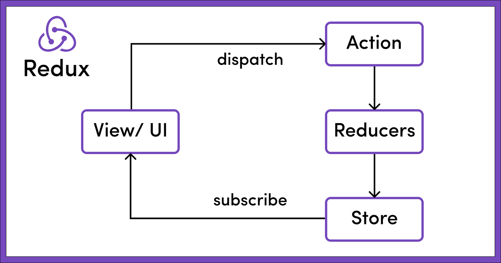

# NGRX state management lifecycle (Ref - https://ngrx.io/guide/store)
- Store a.k.a `ngrx' is a global state management for Angular applications powered by RxJS and inspired by Redux
- Inspired by Redux means, see below figure

- Redux is a tiny JS libray (2kb including dependency) that can be used with ReactJS or other JS powered applications
- But for Angular, we do have Redux equivalent <b>NgRx</b>
## Key concepts
- ```Actions``` describe unique events that are dispatched from components/UI and services.
- State changes are handled by pure functions called ```reducers``` that take the current state and the latest action to compute a new state. <b>Basically it's a place where the logic sits for modifying/updating state or data</b>
- Selectors are pure functions used to select, derive and compose pieces of state. (Need more clarity)
- State is accessed with the Store, an observable of state and an observer of actions.

## State management types
- NgRx Store is mainly for ```managing global state across an entire application.```
- In cases where you need to ```manage temporary or local component state```, consider using [NgRx ComponentStore](https://ngrx.io/guide/component-store)

## Diagram of NgRx (It gets little confusing w.r.t ```Selector, Service, Effects``` but read below ```Note```)

- Note: All Actions that are dispatched within an application state are always first processed by the Reducers before being handled by the Effects of the application state.
    - Meaning, before going to the Effects, NgRx will try to resolve the state management within itself first and later can go to ```Effects and Service```
    - For ```Selector``` just keep in mind that it is responsible to update the UI after receiving the latest state
    - ```Store``` will have current state and once ```reducer``` reaches the Store, Store will also have the latest computed state which will be sent to UI via ```Selector```

## When to use NgRx?
- If application is growing big, managing state via ```services/Subject/BehaviorSubject/Signals/@Input-@Output-EventEmitter``` becomes heavy and difficult to understand. Basically, when there's lots of code for small tasks
- At first, NgRx seems tedious approach, but transferring state management from above mentioned options to NgRx will result cleaner yet maintainable code
- Not Recommended for smaller applications, else could lead to high complexity for small tasks